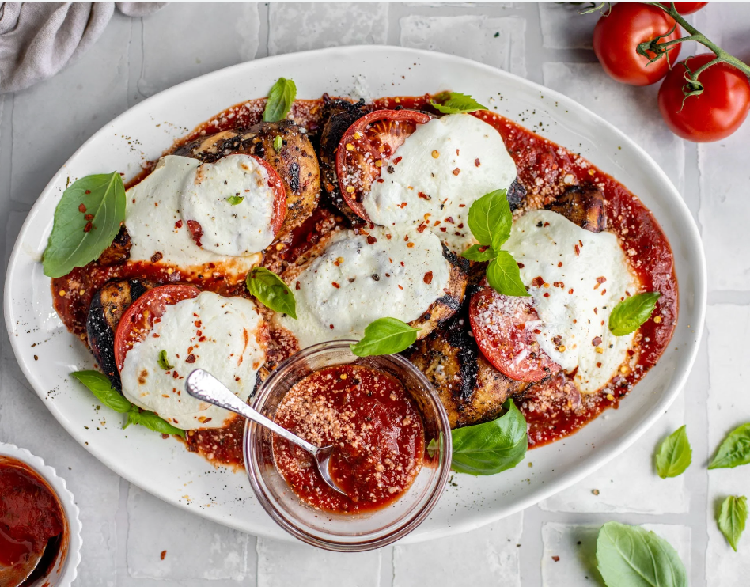

This healthier twist on the classic chicken parmesan is perfect for those looking for a high-protein meal. Boneless, skinless chicken breasts are coated in whole wheat breadcrumbs and Parmesan cheese, then grilled to perfection. The chicken is then topped with marinara sauce and mozzarella cheese, creating a delicious and satisfying meal.

## Ingredients

* 4 boneless, skinless chicken breasts
* 1/2 cup whole wheat breadcrumbs
* 1/2 cup grated Parmesan cheese
* 1/2 tsp dried oregano
* 1/2 tsp garlic powder
* 1/4 tsp salt
* 1/4 tsp black pepper
* 2 eggs, beaten
* 1/4 cup olive oil
* 2 cups marinara sauce
* 1 cup shredded mozzarella cheese

## Method

1. Preheat grill to medium-high heat.
2. In a shallow dish, combine the breadcrumbs, Parmesan cheese, oregano, garlic powder, salt, and black pepper.
3. Dip each chicken breast in the beaten eggs, then coat with the breadcrumb mixture.
4. Drizzle the olive oil over the chicken breasts and grill for 6-8 minutes per side, or until cooked through.
5. Spread the marinara sauce over each chicken breast and top with the shredded mozzarella cheese.
6. Grill for an additional 2-3 minutes, or until the cheese is melted and bubbly.