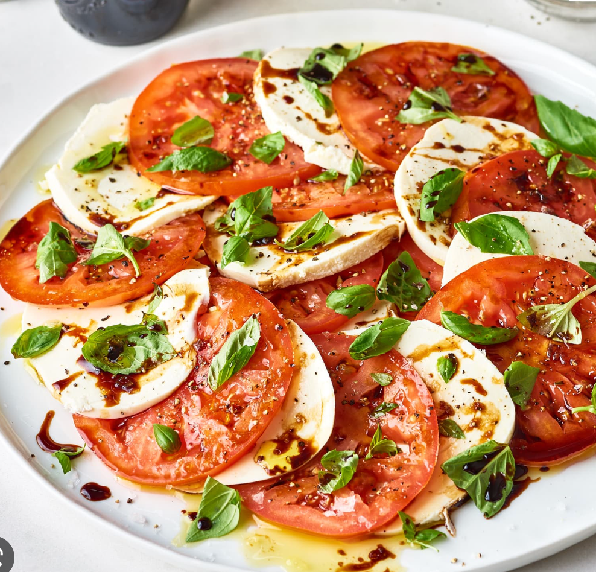

This refreshing and colorful salad is made with juicy ripe tomatoes, creamy fresh mozzarella cheese, and fragrant basil leaves. The salad is dressed with a simple balsamic vinaigrette that enhances the flavors of the tomatoes and cheese. This salad is perfect for a light lunch or a starter before a main course.

## Ingredients

* 2 large tomatoes, sliced
* 8 oz fresh mozzarella cheese, sliced
* 1/4 cup chopped fresh basil
* 2 tbsp balsamic vinegar
* 2 tbsp olive oil
* Salt and black pepper to taste

## Method

1. Arrange the tomato and mozzarella slices on a platter or individual plates.
2. Sprinkle the chopped basil over the top.
3. In a small bowl, whisk together the balsamic vinegar and olive oil.
4. Drizzle the dressing over the salad and season with salt and black pepper to taste.